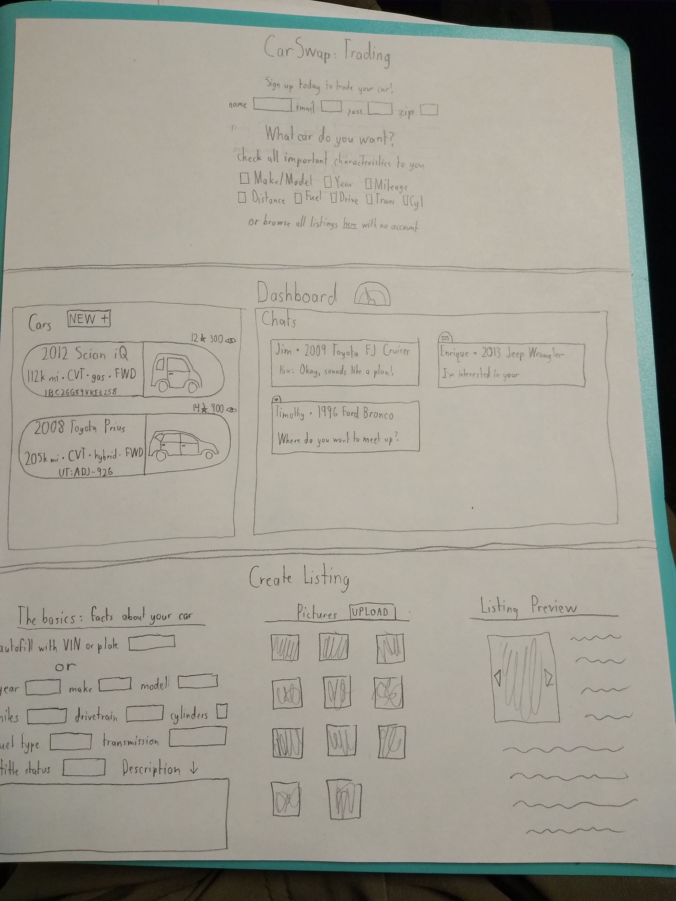
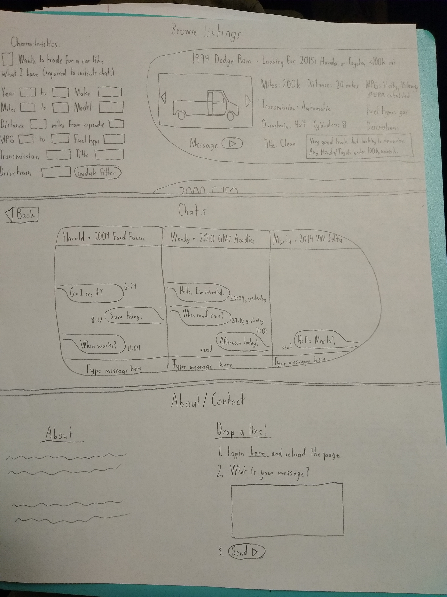

# startup
## Specification deliverable
### Elevator pitch

Have you ever wanted to replace your car? Not just sell your car for cash and hunt separately for a new vehicle? This website will allow you to save money compared to a trade-in at the dealership, because you can connect with other car owners who want to trade their car for yours.

### Design

### Key features

- Secure login over HTTPS
- Ability to post and edit vehicle listings
- Ability to sort through, browse, and save vehicle listings
- Ability to chat with listing owners
- Vehicle listings, analytics, and chat history are persistently stored
- Vehicle listing analytics available to listing owner

### Technologies

I am going to use the required technologies in the following ways.

- HTML - To make correct structure for my application. I will have the following HTML pages: home/login page, personal dashboard, create listing, browse listings, chat window, and about/contact.
- CSS - To make application styling that looks good on different screen sizes, uses good whitespace, color choice and contrast.
- JavaScript - To provide login, chat functionality, listing display (browsing, editing, and posting), backend endpoint calls.
- Service - Backend service with endpoints for:
  - login and creating accounts
  - retrieving and submitting listing, chat, and analytics data
- DB/Login - Store users, chat data, and listings (+analytics) in database. Register and login users. Credentials securely stored in database.
- WebSocket - As users browse listings, analytics are updated to owner. As owners post, listings are updated to users. Chat messages are instantly relayed to the other person.
- React - Application ported to use the React web framework.

## HTML Deliverable

For this deliverable I built out the structure of my application using HTML.
- HTML pages - seven HTML pages that represent the homepage and the ability to login, browse listings, create listings, chat with users, manage listings and chats, and contact the developer (me).
- Links - Five of the seven pages are accessible from the nav bar at the top of the screen. The Create Listing page is accessible from the Browse and Dashboard pages. And the Chat page is accessible from the Dashboard page.
- Text - Includes necessary text on all pages, such as (but not only) text representing the choices of which car(s) to search for on the Browse page.
- 3rd party service calls - Vehicle info in "Create Listings" will be auto-populated using the VIN API from the NHTSA.
- Images - There are two images on the homepage as well as several images in the Dashboard and Browse pages from sample listings.
- DB/Login - Input box and submit button for login. The listing information represents data pulled from the database, and a sample listing is in the HTML.
- WebSocket - The dashboard and browse statistics for saves and views represent real-time user data. The chat data also represents real-time data from other users.